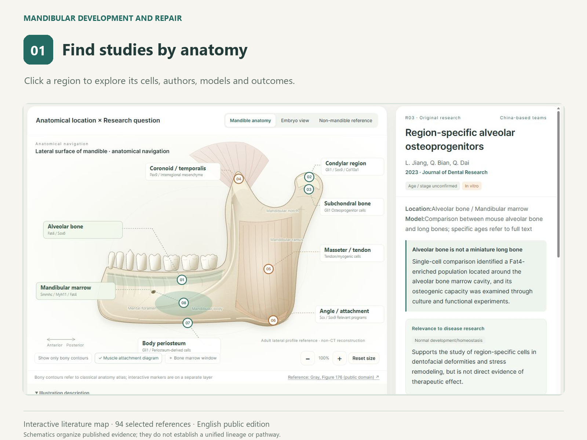
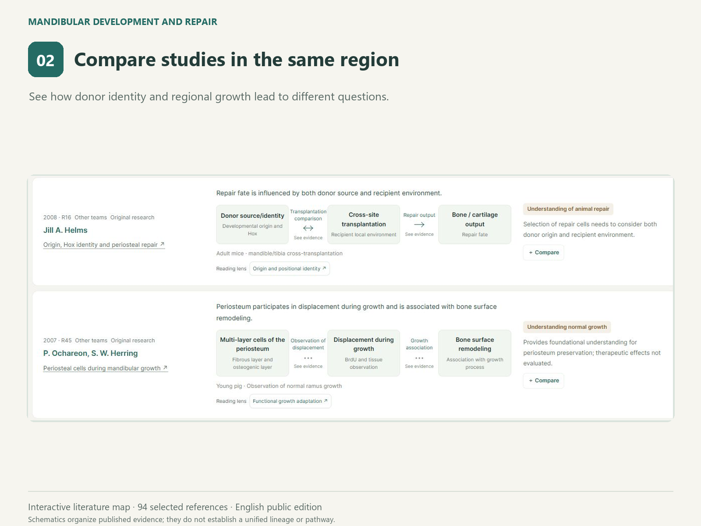
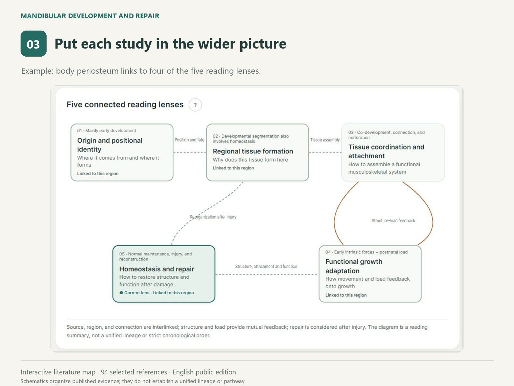

# Mandibular Development and Repair

An interactive literature map connecting **anatomical regions, individual studies and five reading lenses**.

**[Open the map](https://xuli500177.github.io/mandibular-literature-map/)** · Version **1.1.0** · [Changes](CHANGELOG.md)

Current coverage emphasizes local cell populations, periosteum, condyle and tendon–muscle–bone interactions. Dental–periodontal, neurovascular, immune and some repair themes remain partial. Fewer records in a region indicate map coverage, not absence of research.

Start with a region on the mandibular diagram, compare what different studies explain, then locate those studies in the wider picture. Each record links to its original source and separates its main claim from its evidence and scope.

## What is included

- 103 independent references: 96 main records and seven additional framework sources, across development, tissue interactions, growth adaptation and repair. Two preprints are hidden by default.
- 18 navigation categories, including mandibular and embryonic regions, comparison tissues and reviews. These categories are not 18 discrete anatomical compartments.
- Five reading lenses: origin and positional identity; regional tissue formation; tissue coordination and attachment; functional growth adaptation; homeostasis and repair.
- Study models, species, stages, cells and markers, complete bibliographic authors, evidence limits and reported outcomes.
- 16 claims across seven core papers linked to models, experiments, measured endpoints and original figure/section locations. Other records still await individual claim anchoring.
- Search by record ID, DOI, DOI URL, title or author; copy full citations and study/view links; report a record-specific correction.
- Region study views, reference filters, comparison notes and reference-table export. Two preprints are hidden by default and can be included using the preprint filter.

## How to read it

1. **Anatomical overview:** choose a region or an embryonic/comparison category.
2. **Study view:** compare the questions, proposed explanations and supporting studies within that region.
3. **Reading lenses:** use the local filter to narrow that region's studies, or choose “Locate in overview” to see its place in the wider picture.

Hover over help markers for explanations. A study can belong to more than one lens. The lenses are an editorial reading aid, not a claim that the field has one unified theory or that every cell population fits a single hierarchy.

## Three-step demonstration

| Find studies by anatomy | Compare studies in one region | Locate them in the wider picture |
| --- | --- | --- |
|  |  |  |

These illustrations show real interface states from version 1.0.0; counts and some controls have since changed. Click an image to read the larger version, or [open the interactive map](https://xuli500177.github.io/mandibular-literature-map/) to explore the studies and their original sources.

## Scope and provenance

This is a **curated literature guide**, not an exhaustive systematic review, a measured spatial cell atlas or a source of clinical treatment recommendations. A mandibular schematic helps navigation; hotspots do not represent measured cell coordinates. References involving other bones, species or tissues are comparison evidence, not direct proof about the human mandible.

Positive marker expression, lineage tracing, transcriptomic clusters and functionally tested stem/progenitor populations are different kinds of evidence. Associations and inferred cell communication do not by themselves demonstrate mechanism. Animal repair results and proposed applications do not establish clinical efficacy.

The selection originated in a Chinese research reading map. The English public edition uses AI-assisted translation and interface editing, with terminology and bibliography checks. Reading-depth labels reflect the source map's recorded review depth; inclusion does not mean that every full text has been independently reread for this release. Please check the original paper before reusing a scientific conclusion. English titles for Chinese-language articles may be translations.

The original bibliography was assembled through **4 October 2026**, with targeted additions and corrections on **5 October 2026**. Topic searches in Chinese and English, source reading and citation tracking informed selection. PubMed/Europe PMC, Crossref and journal sources support this revision; no preregistered systematic search or duplicate screening was performed. It is not continuously updated. Corrections and suggestions for missing work are welcome through GitHub issues.

## Privacy

The page has no analytics, external scripts or login. Discussion notes remain in your browser's local storage and are not sent to this repository. A downloaded copy made using the note-export feature can contain your notes; inspect it before sharing. Opening a paper's source link takes you to that publisher or repository.

## Run locally

Download `index.html` and open it in a modern browser. The application is a standalone HTML file and needs no build step or backend.

## Contribute, build and cite

Public structured data are in `data/atlas.json`; `src/shell.html` supplies the interface. Run `python scripts/build.py` to regenerate the standalone page and `node scripts/validate.cjs` for data and interaction regression checks. These checks do not substitute for browser, touch or assistive-technology testing. See [contribution guidance](CONTRIBUTING.md) for corrections and review scope.

Stable examples: [R95](https://xuli500177.github.io/mandibular-literature-map/#paper=R95), [periosteal studies](https://xuli500177.github.io/mandibular-literature-map/#view=region&region=periosteum), and [repair lens](https://xuli500177.github.io/mandibular-literature-map/#lens=repair). Shared links do not carry private notes. Local browser Back/Forward restores viewing context and filters; complex filter combinations are not yet encoded in share links.

Use [CITATION.cff](CITATION.cff) to cite this map and include the version and access date. Cite the original paper when reusing a scientific conclusion.

## Attribution and reuse

The mandibular outline was redrawn with reference to **[Gray's Anatomy, figure 176](https://commons.wikimedia.org/wiki/File:Gray176.png)**, a public-domain anatomical illustration. The overlays and interface are original schematic navigation elements. Publisher figures and article full texts are not bundled.

Original code and original editorial content are provided under the [MIT license](LICENSE). This license does not grant rights to cited publications, article titles or third-party material; those remain subject to their respective rights and terms. When reusing the map, please retain its source links, attribution and scope statements.

Maintained by **XYL / [xuli500177](https://github.com/xuli500177)**.
